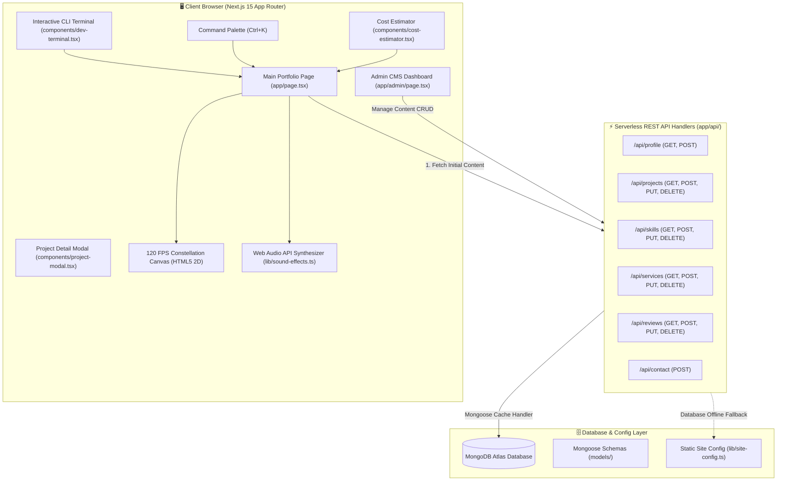

<div align="center">

  <!-- Dynamic Waving Header Banner -->
  

  <!-- Animated Typing SVG Subtitle -->
  <a href="https://git.io/typing-svg">
    
  </a>

  <br/><br/>

  <!-- Badges Row 1: Core Technologies -->
  <p align="center">
    <a href="https://nextjs.org/"></a>
    <a href="https://react.dev/"></a>
    <a href="https://www.typescriptlang.org/"></a>
    <a href="https://tailwindcss.com/"></a>
    <a href="https://www.mongodb.com/"></a>
    <a href="https://mongoosejs.com/"></a>
  </p>

  <!-- Badges Row 2: Status & Ratings -->
  <p align="center">
    <a href="https://www.fiverr.com/musman079"></a>
    
    
    
    
  </p>

  <br />

  <p align="center">
    <strong>An elite, hyper-responsive, full-stack developer portfolio and headless CMS platform. Engineered with Next.js 15 App Router, React 19, TypeScript, Tailwind CSS, an interactive Dev CLI Console, Web Audio API Sound Synthesizer, 120 FPS Particle Constellation physics, and dynamic MongoDB database integration.</strong>
  </p>

  <p align="center">
    <a href="#-table-of-contents"><strong>Explore System Specs »</strong></a>
    &nbsp;•&nbsp;
    <a href="#-system-architecture"><strong>Architecture</strong></a>
    &nbsp;•&nbsp;
    <a href="#-detailed-features--modules"><strong>Feature Walkthrough</strong></a>
    &nbsp;•&nbsp;
    <a href="#-interactive-dev-cli-terminal"><strong>CLI Terminal</strong></a>
    &nbsp;•&nbsp;
    <a href="#-admin-cms-manual"><strong>Admin CMS</strong></a>
    &nbsp;•&nbsp;
    <a href="#-rest-api-reference"><strong>REST APIs</strong></a>
    &nbsp;•&nbsp;
    <a href="#-getting-started--deployment"><strong>Setup Guide</strong></a>
  </p>

</div>

---

## 📑 Table of Contents

- [🌟 Executive Summary](#-executive-summary)
- [🏗️ System Architecture & Data Flow](#-system-architecture--data-flow)
- [💎 Detailed Features & Modules](#-detailed-features--modules)
  - [1. Interactive Dev CLI Terminal Emulator](#1-interactive-dev-cli-terminal-emulator)
  - [2. Dynamic MongoDB CMS Admin Dashboard (`/admin`)](#2-dynamic-mongodb-cms-admin-dashboard-admin)
  - [3. Web Audio API Synthesizer Sound Engine](#3-web-audio-api-synthesizer-sound-engine)
  - [4. 120 FPS Particle Constellation Physics Canvas](#4-120-fps-particle-constellation-physics-canvas)
  - [5. Interactive Cost & Quote Project Estimator](#5-interactive-cost--quote-project-estimator)
  - [6. Deep Architecture Project Modal Viewers](#6-deep-architecture-project-modal-viewers)
  - [7. Global Command Palette (`Ctrl+K`)](#7-global-command-palette-ctrlk)
  - [8. Dark / Light Mode Glassmorphic Design System](#8-dark--light-mode-glassmorphic-design-system)
- [🛠️ Exhaustive Tech Stack & Ecosystem](#️-exhaustive-tech-stack--ecosystem)
- [📂 Comprehensive Directory Structure](#-comprehensive-directory-structure)
- [📡 Full REST API Reference & Payloads](#-full-rest-api-reference--payloads)
- [🔒 MongoDB Schemas & Data Modeling](#-mongodb-schemas--data-modeling)
- [⚡ Getting Started & Local Development](#-getting-started--local-development)
  - [Prerequisites](#prerequisites)
  - [Installation](#installation)
  - [Environment Variables Configuration](#environment-variables-configuration)
  - [Available NPM Scripts](#available-npm-scripts)
- [🛡️ Security, Validation & Error Handling](#️-security-validation--error-handling)
- [🚀 Deployment Guide (Vercel, Railway, Docker)](#-deployment-guide-vercel-railway-docker)
- [🤝 About the Author & Global Client Network](#-about-the-author--global-client-network)
- [📜 License & Credits](#-license--credits)

---

## 🌟 Executive Summary

This project is a **flagship Next.js 15 enterprise-grade portfolio and dynamic CMS platform** crafted for **Muhammad Usman**, a Full-Stack MERN Engineer and Level-1 Fiverr Freelancer.

Unlike traditional static portfolios that require code modifications and continuous rebuilds to update content, this system integrates **full-fledged headless database persistence (MongoDB Atlas + Mongoose)** with client fallback hydration. It empowers the owner to update bio content, add showcase projects, modify skill proficiencies, adjust hourly/project rates, and manage verified client reviews on the fly via a protected `/admin` control center.

```
┌──────────────────────────────────────────────────────────────────────────┐
│                      Muhammad Usman's Web Platform                       │
├───────────────────────────────┬──────────────────────────────────────────┤
│ Client Layer                  │ Next.js 15 (App Router) + React 19       │
│ UI & Design System            │ Tailwind CSS + Glassmorphism + Radix UI  │
│ Interactive Engines           │ HTML5 Canvas 2D (120 FPS) + Web Audio API│
│ Serverless API Layer          │ Next.js Route Handlers (Edge & Node.js)  │
│ Database Layer                │ MongoDB Atlas + Mongoose Cached Pooling  │
│ CMS Engine                    │ Protected Admin Portal with Real-Time UI │
└───────────────────────────────┴──────────────────────────────────────────┘
```

---

## 🏗️ System Architecture & Data Flow



---

## 💎 Detailed Features & Modules

### 1. Interactive Dev CLI Terminal Emulator
- **Virtual Shell**: Built-in developer console triggered via floating action button, command palette, or keyboard shortcuts.
- **Matrix Rain Animation**: Real-time canvas green binary rain mode (`matrix` command).
- **Audio Feedback**: Custom terminal mechanical keystroke and return audio frequencies synthesized with Web Audio API.
- **Available Commands**:
  - `help` — Lists all executable commands.
  - `skills` — Renders ASCII graphical proficiency breakdown.
  - `projects` — Displays interactive project list with direct URLs.
  - `contact` — Dispatches direct contact details & WhatsApp link.
  - `clear` — Wipes the terminal buffer.
  - `sudo` / `matrix` / `theme` — Interactive easter eggs.

### 2. Dynamic MongoDB CMS Admin Dashboard (`/admin`)
- **Password Protected**: Guarded authentication barrier for administrative operations.
- **Instant Live Sync**: Database edits reflect across the public portfolio instantly without redeploying.
- **Full CRUD Capabilities**:
  - **Projects**: Add live demos, GitHub URLs, architecture tags, accent colors, and deep bullet details.
  - **Skills & Proficiencies**: Create skill groups, adjust percentage sliders, and customize badge hex colors.
  - **Services & Offerings**: Modify full-stack deliverables and pricing tiers.
  - **Testimonials & Reviews**: Add 5-star verified international client reviews with country flags.
  - **Site Profile & Bio**: Modify hero titles, typing animation roles, resume URL, and social accounts.

### 3. Web Audio API Synthesizer Sound Engine
- Zero external audio assets (`.mp3` or `.wav` files). Everything is generated purely via code algorithms!
- Utilizes `AudioContext`, `GainNode`, and `OscillatorNode` with customized frequency envelopes:
  - **Click Chime**: Smooth, high-frequency short ping (`sine` wave @ 800Hz decaying to 400Hz).
  - **Hover Microtone**: Subtle haptic feedback (`triangle` wave @ 520Hz).
  - **Success Chime**: Harmonic double-tone chord on form completion and email copying.
  - **Audio Mute/Unmute**: Global state persistence stored in `localStorage`.

### 4. 120 FPS Particle Constellation Physics Canvas
- High-performance 2D Canvas engine running inside a `requestAnimationFrame` loop.
- **Physics**:
  - Distance-squared proximity calculation linking nearby particles with dynamic opacity lines.
  - **Mouse Repelling Force**: Particles react, accelerate, and deflect away from the user cursor.
  - **Auto-Pausing**: `IntersectionObserver` suspends rendering calculations when scrolled out of view to preserve battery & CPU cycles.

### 5. Interactive Cost & Quote Project Estimator
- Enables founders, recruiters, and clients to configure their project scope:
  - Base platform selection (MERN Stack, Next.js Frontend, API Microservice, Flutter Mobile).
  - Add-ons: JWT Auth, Payment Gateway, Real-Time WebSockets, SEO Optimization, Admin Dashboard.
- Dynamically computes real-time investment estimates with delivery timeline calculations.
- Direct CTA pushes pre-compiled specifications directly into the contact inquiry form.

### 6. Deep Architecture Project Modal Viewers
- Click any project card or "Details" button to launch an extensive modal dialog.
- Features architectural deep-dive, technical challenges overcome, security highlights, and full library dependency breakdowns.

### 7. Global Command Palette (`Ctrl+K` / `Cmd+K`)
- Spotlight-style search bar offering fast navigation across all portfolio sections, external social profiles, theme switching, and quick terminal access.

### 8. Dark / Light Mode Glassmorphic Design System
- Built on `next-themes` with zero flash of unstyled content (FOUC).
- Glassmorphism tokens (`backdrop-blur-xl`, border lighting, smooth hover glow spotlights, 3D card tilt transformations).

---

## 🛠️ Exhaustive Tech Stack & Ecosystem

<div align="center">
  
</div>

<br />

| Category | Technology | Purpose & Description |
| :--- | :--- | :--- |
| **Framework** | **Next.js 15.2 (App Router)** | Server Components, Client Hydration, Metadata SEO, Serverless Route Handlers |
| **UI Library** | **React 19** | Modern concurrent rendering, hooks, transitions, and component architecture |
| **Language** | **TypeScript 5.x** | Strict end-to-end type safety, interfaces, and compile-time validation |
| **Styling** | **Tailwind CSS 3.4** | Utility-first responsive design, custom keyframes, and CSS variables |
| **UI Primitives**| **Radix UI Primitives** | Unstyled, accessible UI foundation (Dialogs, Tooltips, Tabs, Accordions) |
| **Icons** | **Lucide React** | Modern, lightweight SVG iconography |
| **Database** | **MongoDB Atlas** | Cloud NoSQL document database for dynamic CMS persistence |
| **ORM / ODM** | **Mongoose 9.x** | Strict document modeling, connection caching, and data sanitization |
| **Audio** | **HTML5 Web Audio API** | Pure algorithmic software sound synthesis without external audio files |
| **Animations** | **CSS3 3D & Canvas 2D** | 120 FPS particle constellation physics and GPU-accelerated glow effects |
| **Forms** | **React Hook Form + Zod** | Controlled form inputs with schema validation and error feedback |
| **Theming** | **next-themes** | Persistent dark and light theme switching synced with OS preferences |

---

## 📂 Comprehensive Directory Structure

```bash
my-portfolio/
├── 📁 app/                           # Next.js 15 App Router Core
│   ├── 📁 admin/                     # Protected CMS Dashboard
│   │   └── page.tsx                  # Full Administrative Panel UI & State
│   ├── 📁 api/                       # Backend Serverless Route Handlers
│   │   ├── 📁 contact/route.ts       # Client Inquiry Email & Form Endpoint
│   │   ├── 📁 profile/route.ts       # Site Bio, Stats, Socials CRUD
│   │   ├── 📁 projects/route.ts      # Featured Projects CRUD Handlers
│   │   ├── 📁 reviews/route.ts       # Verified Client Reviews CRUD Handlers
│   │   ├── 📁 services/route.ts      # Development Services CRUD Handlers
│   │   └── 📁 skills/route.ts        # Technical Skills & Categories Handlers
│   ├── favicon.ico                   # Custom Brand Favicon
│   ├── globals.css                   # Core Design Tokens, Animations, Glassmorphism
│   ├── layout.tsx                    # Root Layout, Metadata, Font Injectors
│   └── page.tsx                      # Main Single-Page Portfolio Application
├── 📁 components/                    # Modular UI Component Layer
│   ├── command-palette.tsx           # Global Quick Search Bar (Ctrl+K)
│   ├── cost-estimator.tsx            # Real-Time Project Pricing Calculator
│   ├── dev-terminal.tsx              # Interactive CLI Console & Matrix Rain
│   ├── project-modal.tsx             # Deep Architecture Project Inspector Modal
│   ├── theme-toggle.tsx              # Dark/Light Mode Switcher Button
│   └── 📁 ui/                        # Reusable Radix & Tailwind UI System
│       ├── accordion.tsx
│       ├── badge.tsx
│       ├── button.tsx
│       ├── card.tsx
│       ├── dialog.tsx
│       ├── input.tsx
│       ├── textarea.tsx
│       └── tooltip.tsx
├── 📁 hooks/                         # Custom React Hooks
│   ├── use-mobile.tsx                # Responsive Viewport Breakpoint Detector
│   └── use-toast.ts                  # Toast Notification Dispatcher Hook
├── 📁 lib/                           # Core Utilities & Systems
│   ├── mongodb.ts                    # Global Cached Mongoose DB Connection Manager
│   ├── site-config.ts                # Default Fallback Site Data & Configuration
│   ├── sound-effects.ts              # Web Audio API Synth Sound System
│   └── utils.ts                      # Class merging & style helper functions
├── 📁 models/                        # Mongoose Database Data Models
│   ├── Profile.ts                    # User Bio, Stats, and Contact Schema
│   ├── Project.ts                    # Project Schema (Title, Tech, Links, Details)
│   ├── Review.ts                     # Review Schema (Client, Country, Rating)
│   ├── Service.ts                    # Service Schema (Points, Pricing, Color)
│   └── Skill.ts                      # Skill Schema (Category, Items, Level)
├── 📁 public/                        # Static Assets & Images
├── .env.local                        # Local Environment Secrets (Ignored by Git)
├── components.json                   # Shadcn UI Component Configuration
├── next.config.mjs                   # Next.js Build & Compiler Optimization Config
├── package.json                      # Project Manifest & Dependency Tree
├── postcss.config.mjs                # PostCSS Processor Config
├── README.md                         # Comprehensive System Documentation
├── tailwind.config.ts                # Tailwind Theme Extensions & Color Maps
└── tsconfig.json                     # Strict TypeScript Configuration
```

---

## 📡 Full REST API Reference & Payloads

### 1. Projects API (`/api/projects`)
- **`GET /api/projects`**: Fetches all projects from MongoDB. Falls back to static configuration if DB is unreachable.
- **`POST /api/projects`**: Creates a new project in the database.
- **`PUT /api/projects`**: Updates an existing project by `id`.
- **`DELETE /api/projects?id=<PROJECT_ID>`**: Removes a project.

#### Sample JSON Payload (`POST` / `PUT`):
```json
{
  "title": "ThinkBoard",
  "subtitle": "MERN Collaborative Notes App",
  "category": "Full-Stack MERN",
  "description": "Modern note-taking platform with markdown support, user authentication, and rate-limited APIs.",
  "tech": ["MongoDB", "Express.js", "React", "Node.js", "Tailwind CSS", "JWT"],
  "github": "https://github.com/mani78979/mern-thinkboard",
  "live": "https://mern-thinkboard-production-56fc.up.railway.app/",
  "accentColor": "#f59e0b",
  "details": [
    "JWT Authentication with refresh tokens",
    "Full markdown syntax parser",
    "Rate-limited Express.js REST APIs"
  ]
}
```

---

### 2. Skills API (`/api/skills`)
- **`GET /api/skills`**: Retrieves categorized skills matrix.
- **`POST /api/skills`**: Creates a new skill category.

#### Sample JSON Payload:
```json
{
  "category": "Frontend Architecture",
  "items": ["React.js", "Next.js 15", "TypeScript", "Tailwind CSS", "Redux Toolkit"],
  "color": "#06b6d4",
  "level": 95
}
```

---

### 3. Reviews API (`/api/reviews`)
- **`GET /api/reviews`**: Fetches client testimonials.
- **`POST /api/reviews`**: Adds a verified review.

#### Sample JSON Payload:
```json
{
  "name": "john_d***",
  "country": "🇺🇸 United States",
  "rating": 5,
  "review": "Exceptional work! Usman built our full-stack web app ahead of schedule with very clean code.",
  "date": "2 weeks ago",
  "project": "MERN Stack Web App"
}
```

---

## 🔒 MongoDB Schemas & Data Modeling

### Project Model (`models/Project.ts`)
```typescript
const ProjectSchema = new Schema({
  title: { type: String, required: true },
  subtitle: { type: String, required: true },
  category: { type: String, default: "Full-Stack MERN" },
  description: { type: String, required: true },
  tech: { type: [String], required: true },
  github: { type: String, default: "" },
  live: { type: String, default: "" },
  accentColor: { type: String, required: true },
  details: { type: [String], default: [] },
}, { timestamps: true });
```

---

## ⚡ Getting Started & Local Development

### Prerequisites
1. **Node.js**: `v18.18.0` or higher (Node 20 LTS recommended)
2. **Package Manager**: `npm` (v9+), `pnpm` (v9+), or `yarn`
3. **MongoDB**: MongoDB Atlas Cluster connection URI or local MongoDB instance

---

### Installation

1. **Clone the repository**:
   ```bash
   git clone https://github.com/musman079/my-portfolio.git
   cd my-portfolio
   ```

2. **Install dependencies**:
   ```bash
   npm install --legacy-peer-deps
   # or
   pnpm install
   ```

3. **Configure Environment Variables**:
   Create a `.env.local` file in the project root:
   ```env
   # MongoDB Atlas Connection URI
   MONGODB_URI=mongodb+srv://<username>:<password>@cluster.mongodb.net/portfolio?retryWrites=true&w=majority

   # Admin Dashboard Authentication Password
   ADMIN_PASSWORD=admin123
   ```

4. **Start the Development Server**:
   ```bash
   npm run dev
   ```
   Navigate to [http://localhost:3000](http://localhost:3000) to view the application.

---

### Available NPM Scripts

| Command | Description |
| :--- | :--- |
| `npm run dev` | Boots local Next.js development server on port 3000 |
| `npm run build` | Builds optimized production bundle |
| `npm run start` | Starts production Next.js server |
| `npm run lint` | Runs ESLint analysis across TypeScript & React files |

---

## 🛡️ Security, Validation & Error Handling

1. **Graceful DB Degradation**: If MongoDB Atlas is unreachable, the application automatically catches connection timeouts and falls back seamlessly to static configuration in `lib/site-config.ts` without crashing.
2. **Cached Connection Pool**: The database connector utilizes global cached instances to prevent connection leaks during serverless hot-reloads.
3. **Input Sanitization**: REST API endpoints validate payload structure before mutating database documents.
4. **Environment Isolation**: Sensitive credentials (`MONGODB_URI`, `ADMIN_PASSWORD`) are securely read server-side only.

---

## 🚀 Deployment Guide (Vercel, Railway, Docker)

### Deploy on Vercel (Recommended)
1. Push your repository to GitHub.
2. Import the project into the [Vercel Dashboard](https://vercel.com).
3. In **Environment Variables**, add:
   - `MONGODB_URI`: Your MongoDB Atlas URI.
   - `ADMIN_PASSWORD`: Your secret admin password.
4. Click **Deploy**. Vercel will automatically build and optimize your Next.js 15 application.

---

## 🤝 About the Author & Global Client Network

<div align="center">
  
</div>

<br />

- 🏆 **Fiverr Level-1 Seller** with a verified **5.0★ Rating** from clients in the **USA 🇺🇸, UK 🇬🇧, Germany 🇩🇪, Saudi Arabia 🇸🇦, India 🇮🇳**, and beyond.
- 🎓 **BS Computer Science** (2021 — 2025).
- 💡 **Core Expertise**: Full-Stack MERN Architectures, Scalable Next.js 15 Applications, Micro-animations, Figma-to-Code conversions, and Production Deployments.

### 📬 Direct Channels:

<div align="center">

  <a href="mailto:usmankousar772@gmail.com">
    
  </a>
  &nbsp;
  <a href="https://wa.me/923286596772">
    
  </a>
  &nbsp;
  <a href="https://www.linkedin.com/in/musman78">
    
  </a>
  &nbsp;
  <a href="https://www.fiverr.com/musman079">
    
  </a>
  &nbsp;
  <a href="https://github.com/musman079">
    
  </a>

</div>

---

## 📜 License & Credits

This project is licensed under the **MIT License** — feel free to use it for personal inspiration.

<div align="center">
  <sub>Designed & Developed with precision by <strong>Muhammad Usman</strong> • Powered by Next.js 15 & Tailwind CSS</sub>
</div>
